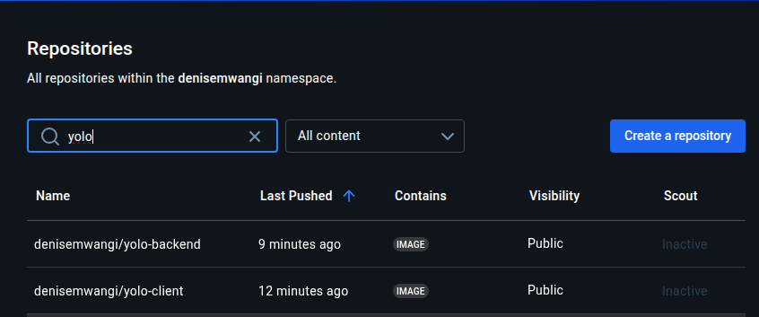

# Overview
This project involves the containerization and deployment of a full-stack YOLO application using Docker and Docker Compose. It includes a React frontend, Node.js backend, and a MongoDB database, all running in isolated containers.

# Requirements
Ensure the following tools are installed on your host machine:

    - VirtualBox

    - Vagrant

## How to launch the application 

## How to Run the Application

1. Clone the Repository:

    git clone <your-repo-url>
    cd yolo

2. Start Everything with One Command:

    vagrant up

This will:

    - Provision a virtual machine running Ubuntu

    - Install Docker and Docker Compose

    - Install Ansible

    - Use Ansible to run Docker Compose inside the VM and start the containers

3. Access the Application:

    Frontend: http://localhost:3000

    Backend API: http://localhost:5000

    MongoDB: Exposed on port 27017 (if needed)

## To Shut Down

    vagrant halt  # Stop the VM
    vagrant destroy  # Remove the VM and clean up